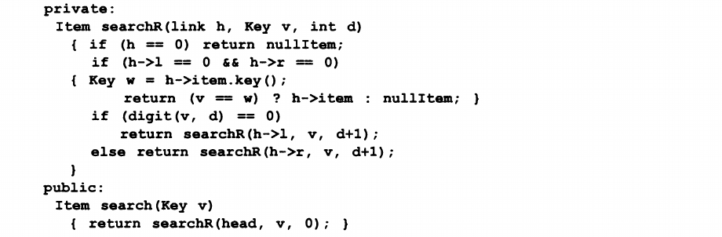
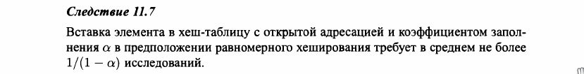
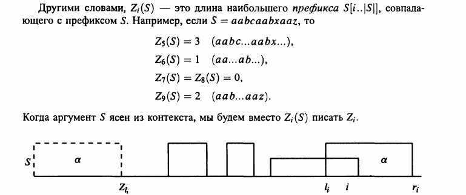
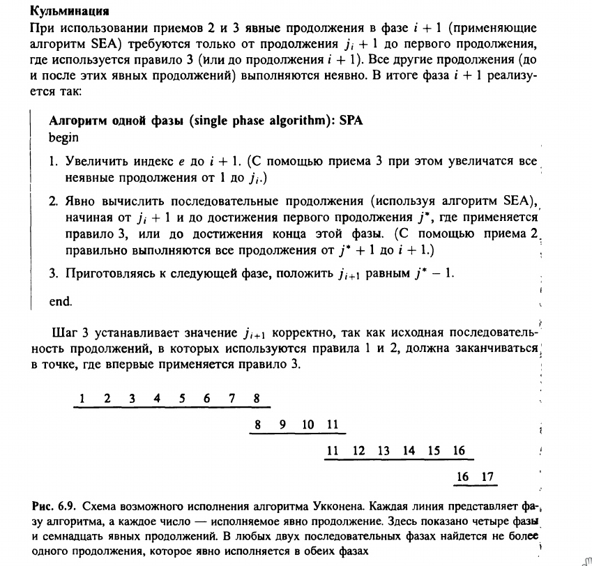

# Сортировки за линейное время <!-- {{{ -->  
## Оценка времени работы сортировок, использующих сравнение элементов
<!-- {{{  Kormen 8.1 -->  
Строим дерево решений (как алгоритм выполняет свою работу). Выполнение
алгоритма сортировки соответсвует прохождению пути от корня дерева до
его листа.  
  
<!-- }}} -->
## Сортировка подсчетом
<!-- {{{ Kormen 8.2 -->  
  
  
Важное свойство алгоритма сортировки подсчетом заключается в его
**устойчивости**.  
<!-- }}} -->
## Поразрядная сортировка
<!-- {{{ Kormen 8.3 -->  
Идем с нижних разрядов, используем устойчивую сортировку.  
  
Доказательство по индукции по столбцам:  
  
  
<!-- }}} -->
## Карманная сортировка
<!-- {{{ Kormen 8.4 -->  
Предполагается, что входные данные подчиняются равномерному закону
распределения.
  
<!-- }}} -->
## Профилирование кода. Бенчмарки. Бенчмарк для сортировок за линейное время
<!-- {{{
https://habr.com/ru/post/482040/
-->  
При использовании любого из профилировщика, лучше смотреть интрукции как
правильно компилировать.  
_Профилирование_ - сбор характеристик работы программы, таких как время
выполнение отдельных фрагментов, число верно предсказанных условных
переходов, число кэш-промахов.  
_Отладка_ - этап разработки программы, на котором обнаруживают,
локализуют и устраняют ошибки.  
### Callgrind
Эмулируют каждую исполняемую инструкцию программы и на
основании внутренних метрик о "стоимости" работы каждой инструкции
выдает нужное нам заключение (из-за такого подхода иногда бывает так,
что callgrind не может распознать очередную инструкцию и вываливается с
ошибкой)
### google perftools
Приостанавливает выполнение программы через равные промежутки времени и
пытается определить, в какой функции в данный момент находится.
### Gprof
При компиляции на концах функции расставляются контрольные точки.
Разница между этими точками и есть время исполнения.
### Perf
Работает на счетчиках производительности (регистры аппаратного
обеспечения процессора, которые подсчитывают события, инструкции и т.д.)
### Профилирование памяти
+ massif - `valgrind --tool=massif  ./test_profiler 1000000`  
+ heapdump - `HEAPPROFILESIGNAL=23 HEAPPROFILE=./heap ./test_profiler 100000000`  
    заменяет стандартные функции выделения памяти.
### Бенчмарки
Смотрим от каких переменных зависит сложность алгоритма. Варьируем эти
переменные и строим график: размер - время выполнения.  
Для подсчета времени можно использовать утилиту окружающей среды (в
моем случае `time`), или сделать программу, которая сама будет считать
тесты и время.  
<!-- }}} -->
<!-- }}} -->
# Сбалансированные и сильноветвящиеся деревья поиска, хеш-таблицы <!-- {{{ -->  
_Дерево_ - связный ациклический граф. Число ребер в дереве на единицу
меньше числа вершин.  
## Бинарные деревья поиска. Основные операции (поиск, вставка, удаление, поворот, поиск следующего/предыдущего)
<!-- {{{ Kormen 12.1 -->  
Обходы деревьев:  

+ Центрированный (симметричный) (inorder tree walk) - ЛКП  
+ Обход в прямом порядке (preorder) - КЛП  
+ Обход в обратном порядке (postorder tree walk) - ЛПК  

### Поиск
`O(h)`  
  
  

### Следующий
  
для предыдущего - наоборот.

### Вставка
`O(h)`
  

### Удаление
Удаляем узел z. Случаи:  

1. У z нет левого узла - заменяем на правый узел.  
2. Если только один левый - заменяем левым.  
3. находим узел _y_ следующий за _z_. Вырезаем (удаляем) _y_ из его
   текущего положения и заменяем им в дереве узел _z_.  
3.1 Если _y_ является правым дочерним узлом _z_, то мы прикрепляем левую
   сторону от _z_ к _y_.  
3.2 В противном случае, сначала заменяем _y_ его собственным правым
   дочерним узлом, а затем заменяем _z_ на _y_  

  


`TRANSPLANT` - заменяет элемент в дереве (второй аргумент) на другой
элемент (третий аргумент)  
Сложность - _O(h)_  
<!-- }}} -->
## AVL-деревья. Основные операции
<!-- {{{ neerc.ifmo.ru, Kormen 13.3
-->  
   <!-- определение -->  
### Балансировка
Используется когда модуль разности высот левого и правого поддеревьев
отличаются больше чем на единицу.  
   <!-- типы балансировок и псевдокод -->  
### Вставка
   <!-- объяснение -->  
### Удаление
   <!-- объяснение -->  
### Слияние
   <!-- объяснение -->  
   <!-- визуально -->  
### Разделение
Сложность  `O(lg n)`  
   <!-- объяснение -->  
   <!-- визуально -->  
   <!-- визуально -->  

<!-- }}} -->
## Красно-черные деревья. Основные операции
<!-- {{{ Kormen 13.1 -->  
  <!-- определение -->  
   <!-- требования -->  
   <!-- требования -->  
Черная высота - кол-во черных узлов на любом простом пути от узла _x_
(не считая сам узел) к листу.  
Почему красно черное дерево хорошо использовать как дерево поиска?  
   <!-- про высоту -->  
Операции над деревом могут разрушать красно-черную структуру, поэтому
люди придумали повороты:  
   <!-- визуально повороты -->  
   <!-- псевдокод поворотов -->  
  

### Вставка
Сложность - _O(_ lg _n_ )  
Используем модифицированную версию обычной вставки. Сначала вставляем
узел, окрашиваем его в красный цвет и вызываем вспомогательную процедуру
`RB-Insert-Fixup`, которая перекрашивает узлы и выполняет повороты.
  <!-- псевдокод вставки -->  
  <!-- псевдокод InsertFixup -->  
  <!-- объяснение -->  
  <!-- объяснение -->  
Для сохранения инварианта рассмотрим 3 случая (другие три будут
симметричны этим):
   <!-- разделение на случаи -->  
**Случай 1. "Дядя" у узла _z_ - красный**  
   <!-- что делаем в первом случае -->  
**Случай 2. "Дядя" у узла _z_ - черный, и _z_ - правый потомок**  
**Случай 3. "Дядя" у узла _z_ - черный, и _z_ - левый потомок**  
   <!-- алгоритм схематично -->  
   <!-- алгоритм схематично -->  
Коротко - сначала левый поворот, потом правый на уровне выше и
перекраска центрального и его детей.

### Удаление
   <!-- RB-Transplant -->  
   <!-- RB-Delete -->  
   <!-- объяснение -->  
   <!-- объяснение -->  
   <!-- RB-Delete-Fixup -->  
   <!-- возможные случаи -->  
   <!-- 4 случая подробно -->  

<!-- }}} -->
## Декартовы деревья. Основные операции. Неявные декартовы деревья
<!-- {{{ e-maxx, neerc.ifmo.ru -->  
Декартово дерево - структура данных, объединяющая в себе бинарное дерево
поиска и бинарную кучу (treap(tree+heap), дерамида(дерево+пирамида)).  
   <!-- объявление на c -->  

### Разделение
   <!-- объяснение -->  
   <!-- псевдокод на c -->  
   <!-- псевдокод на c -->  

### Слияние
   <!-- объяснение -->  
   <!-- псевдокод на c -->  

### Вставка
   <!-- объяснение -->  
   <!-- псевдокод на c -->  

### Удаление
   <!-- объяснение -->  
   <!-- псевдокод на c -->  

### Построение
  

### Высота
В декартовом дереве из n узлов, приоритеты y которого являются случайными
величинами c равномерным распределением, средняя глубина вершины `O(lg n)`  

### Неявное декартово дерево
Фактически, неявное декартово дерево можно воспринимать как массив,
над которым можно реализовать следующие операции (все
за _O(_ lg _n)_ в режиме онлайн):  
Вместо ключа будем считать количество элементов в нашей структуре,
находящихся левее нашего элемента. Иначе говоря, будем считать ключом
порядковый номер нашего элемента в дереве, уменьшенный на единицу.  
Также заведем вспомогательную величину `C` которая будет обозначать
"количество элементов в текущем поддереве"  
Ключ не будем явно хранить, а будем вычислять с помощью вспомогательной
величины `C`:  

+ На пути от корня до листа суммируем `C` увеличинное на единицу по всем левым
  сыновьям по которым мы не прошли. В конце прибавляем `C` левого сына.  
+ Получаем неявный ключ  

+ Вставка элемента в массив в любую позицию  
+ Удаление произвольного элемента  
+ Сумма, минимум/максимум на произвольном отрезке и т.д.  
+ Прибавление, покраска на отрезке  
+ Переворот (перестановка элементов в обратном порядке на отрезке)  

   <!-- объявление на c -->  

Обновление счетчика предыдущих узлов:  
```txt
void update(Treap t)
    t.size = 1 + t.left.size + t.right.size
```

### Разделение в неявном декартовом дереве
   <!-- объяснение и псевдокод -->  

### Слияние в неявном декартовом дереве
Так же как и в явном.  

### Вставка/Перестановка
+ Вставить элемент в любое место (отрежем нужное количество
   элементов слева, сольем левое дерево с деревом из одного
   добавленного элемента и результат — с правым деревом),  
+ Переставить любой кусок массива куда угодно (сделаем нужные
   разрезы и слияния в правильном порядке),  

<!-- }}} -->
## B-деревья. Основные операции
<!-- {{{ Kormen, ch. 18, p. 521 -->  
   <!-- определение -->  
Чтобы минимизировать кол-во обращений к диску, размер узла B-дерева
обычно соответствует дисковой странице (степень ветвление - от 50 до
2000).  
   <!-- определение -->  
   <!-- определение -->  
   <!-- определение верхней границы высоты -->  

### Поиск
   <!-- псевдокод -->  

### Создание, вставка и разбиение
   <!-- псевдокод создания -->  
Поскольку вставить новый ключ в заполненный лист невозможно, мы вводим
новую операцию - **_разбиение_** заполненного (содержащего 2t-1 ключей)
узла _y_ на два, каждый из которых содержит по _t-1_ ключей. Медиана,
или средний ключ при этом перемещается в родительский по отношению к _y_
узел, где становится разделительной точкой для двух вновь
образовавшихся поддеревьев.  
При проходе от корня к листьям в поисках позиции для нового ключа мы
разбиваем все заполненные узлы, через которые проходим (включая сам
лист).  

   <!-- описание разбиения -->  
   <!-- псевдокод разбиения -->  
   <!-- описание и псевдокод вставки -->  
   <!-- Insert-Nonfull -->  

### Удаление
   <!-- алгоритм -->  
   <!-- алгоритм вторая часть -->  
   <!-- пример -->  

### Поиск
Пользуемся свойствами  

<!-- }}} -->
## Trie. Основные операции
<!-- {{{ Sedzhvik, ch. 15.2, p. 608 -->  
_Префиксное дерево_ (бор, trie) - структура данных, позволяющая хранить
ассоциативный массив, ключами которого являются строки. Представляет
собой корневое дерево, каждое ребро которого помечено каким-то символом так, что
для каждого узла все рёбра, соединяющие этот узел с его сыновьями,
помечены разными символами.  
Префиксное дерево содержит какую-либо строку-ключ тогда и только тогда,
когда эту строку можно прочитать на пути из корня до некоторого
выделенного узла.  
   <!-- определение -->  
<!--  -->
<!-- trie - re_trie_val   -->
### Поиск
Выполняем интуитивно  
<!-- Идем влево если очередной разряд - 0, иначе - вправо. Если путей нет - -->
<!-- сравниваем строки.   -->
   <!-- функция поиска -->  
<!--  -->
### Вставка
Выполняем интуитивно  
   <!-- объяснение вставки -->  
<!--  -->
   <!-- псевдокод 1 -->  
<!--  -->
   <!-- псевдокод 2 -->  
<!--  -->
   <!-- лемма про кол-во сравнений -->  
<!--  -->
   <!-- лемма про среднее кол-во узлов -->  
<!--  -->
### Затраты по памяти
`O(MN)` - где `N` - размер алфавита, `M` - суммарная длинна слов  
### Применение
Автодополнение токенов  
<!-- }}} -->
## PATRICIA trie. Основные операции
<!-- {{{ Sedzhvik, ch. 15.3, p. 617 -->  
Базисное дерево (также компактное префиксное дерево) — это структура данных,
представляющая собой оптимизированную по памяти реализацию префиксного дерева.
В базисном дереве узел A, являющийся единственным потомком узла B, сливается с
узлом B.  
<!-- Patricia (practical algorithm to retrieve information coded in -->
<!-- alphanumeric - практический алгоритм получения информации, -->
<!-- закодированной алфавитно-цифровыми символами)   -->
<!-- Характеристики производительности не зависят от длины ключей, и -->
<!-- структура данных подходит для ключей переменой длины.   -->
### Структура
Если у нода только один узел, они вдвоем сливаются в одно ребро  
<!-- + В каждый узел помещается индекс разряда, который должен проверяться с -->
<!--   целью выбора пути из этого узла   -->
<!--     Избегаем однонаправленного ветвления   -->
<!-- + Данные хранятся во внутренних узлах, а связи с внешними узлами -->
<!--   заменяются связями, которые указывают в обратном направлении вверх на -->
<!--   требуемый внутренний узел в trie-дереве   -->
<!--     Исключаем внешние узлы   -->

### Поиск
Интуитивный поиск  
<!-- Если ключ в узле, указанный первой направленной вверх связью, равен -->
<!-- искомому ключу, поиск является успешным.   -->
   <!-- псевдокод и объяснение поиска -->  
<!--  -->

### Вставка
Интуитивная вставка  
<!-- Случаи в `insertR`:   -->
<!--  -->
<!-- 1. Новый узел может замещать внутреннюю связь (если ключ поиска -->
<!--    отличается от ключа, найденного в позиции разряда, который был -->
<!--    пропущен)   -->
<!-- 2. Замещать внешнюю связь (если разряд, который отличает искомый ключ от -->
<!--    найденного, не потребовался для различения найденного улюча от всех -->
<!--    других ключей в trie-дереве)   -->

   <!-- псевдокод 1 -->  
<!--  -->
   <!-- псевдокод 2 -->  
<!--  -->

<!-- ### Сортировка -->
   <!-- пример и псевдокод -->  
<!--  -->
   <!-- лемма про вставку и поиск -->  
<!--  -->

### Затраты по памяти
`O(nN + M)` - где `N` - размер алфавита, `M` - суммарная длинна слов, `n` -
количество строчек записанных в дереве  

<!-- }}} -->
## Хеш-таблицы. Основные свойства. Коллизии, способы разрешения
<!-- {{{ Kormen, ch. 11.2, p. 288 -->  
   <!-- общее про хеширование -->  
Два ключа могут быть хешированы в одну и ту же ячейку. Такая ситуация
называется **_коллизией_**.  

### Разрешение коллизий с помощью цепочек
   <!-- про хеширование цепочками -->  
   <!-- про коэффициент заполнения -->  
   <!-- дополнительная информация -->  
   <!-- дополнительная информация -->  
   <!-- про неудачный поиск в худшем случае -->  
   <!-- про успешный поиск в среднем случае -->  
<!-- }}} -->
## Хеш-функции. Схемы построения, универсальное хеширование
<!-- {{{ Kormen, ch. 11.3, p. 294 -->  
Качественная хеш-функция удовлетворяет (приближенно) предположению
простого равномерного хеширования: для каждого ключа равновероятно
помещение в любую из _m_ ячеек независимо от хеширования остальных
ключей.  
### Метод деления
  
  
### Метод умножения
  
  
  <!-- пример -->  
  <!-- пример -->  
### Универсальное хеширование
  <!-- определение -->  
  <!-- универсальное множество, вероятность коллизии -->  
  <!-- про длинну списка и унив. мн-во -->  
  <!-- про длинну списка и унив. мн-во -->  
  <!-- почему унив. мн-во такое крутое -->  
  <!-- построение унив. мн-ва -->  
<!-- }}} -->
## Метод открытой адресации. Идеальное хеширование
<!-- {{{ Kormen, ch. 11.4, p. 302 -->  
### Метод открытой адресации
  <!-- определение -->  
  <!-- как ищем -->  
  <!-- условие работы -->  
При удалении ключа из ячейки _i_ мы не можем просто пометить ее пустым
значением NIL. Поэтому помечаем такие ячейки специальным значением
DELETED. Немного модифицируем вставку и поиск.  

> Последовательно пушим вместе с ключом значения `0..m-1`. Нам хэш
> функция возвращает следующее значение для просмотра  

Линейное исследование (длинные серии заполненных ячеек имеют денденцию
ко все большему удлиннению):  

```
h(k,i)=(h'(k)+i)mod m
```

Квадратичное исследование (нужен выбор специальных параметров, чтобы
исследование покрывало все ячейки) (более мягкая кластеризация):  

```
h(k,i)=(h'(k)+c_1*i+c_2*i^2)mod m
```

Двойное хеширование:  

```
h(k,i)=(h_1(k)+ih_2(k))mod m
```

в этом случае удобно выбрать простое `m` и хеш-функции:  

```
h_1(k)=k mod m
h_2(k)=1+(k mod m') // m' немного меньше m (можно m-1)
```

  <!-- условие работы -->  
  <!-- условие работы -->  

### Идеальное хеширование
Идеальное хеширование - методика, которая вполняет поиск за _O_(1)
обращений к памяти в наихудшем случае.  
Можем применить, только когда у нас имеется **статическое** множество
ключей.  
Для создание схемы используем двухуровневую схему хеширования с
универсальным хешированием на каждом уровне.
<!-- отсутствие коллизий -->
_Про отсутствие коллизий_  
  
_Про расход памяти._  
  <!-- кол-во памяти -->  
  <!-- кол-во памяти -->  

Несмотря на то, что вторая таблица имеет размер `n_j^2` общие затраты
памяти не превышают `O(n)`  

<!-- }}} -->
<!-- }}} -->
# Поиск образца в текста <!-- {{{ -->

## Z-блоки, построение за линейное время. Поиск подстроки в строке за линейное время с использованием Z-блоков
<!-- {{{ Gasfield, ch. 1.3, p. 27 -->  
  <!-- Z-функция -->  
  <!-- пример -->  
  <!-- Z-блок -->  
Обозначим значение `j`, на котором достигается этот максимум, через `l_i`  

### Построение за линейное время
Сначала по определению считаем `Z_2` (кол-во совпадающих символов).
Затем используем алгоритм  
  <!-- алгоритм -->  
  <!-- алгоритм -->  
  <!-- схематично -->  
  <!-- следствие -->  

### Поиск подстроки в строке за линейное время
  <!-- объяснение -->  

<!-- }}} -->
## Алгоритм Кнута-Морриса-Пратта. Построение префикс-функции на основе Z-блоков. Алгоритм реального времени
<!-- {{{ Gasfield, ch. 2.3, p. 46 -->  
Алгоритм КМП обладает лишь незначительным преимуществом перед прямым
использованием Zi. Однако приспособлен в алгоритме Ахо-Корасика.  
Более того, его легко доказывать, хотя в некоторых случаях ведет себя
хуже чем алгоритм Бойера-Мура.  
  <!-- sp(i) -->  
  <!-- sp'(i) | сильное правило -->  
  <!-- теорема про совпадение -->  
  <!-- теорема про сдвиги -->  
  <!-- теорема про количество сравнений -->  

### Построение префикс-фукнции на основе Z-блоков
  <!-- теорема про поиск sp'(i) -->  
  <!-- псевдокод построения sp'(i) -->  
  <!-- функция неудач F'(i) -->  
  <!-- КМП целиком, только там функция F должна быть другой -->  

### Алгоритм реального времени
  <!-- почему не метод реального времени -->  
Чтобы быть методом реального времени, он должен делать не более чем
константную работу между первой и последней проверками любой позиции в
_T_.  
  <!-- sp'(i,x) -->  
  <!-- теорема про нахождение значений этой ф-ции -->  
  <!-- псевдокод для поиска значений -->  

<!-- }}} -->
## Классический алгоритм Кнута-Морриса-Пратта
<!-- {{{ Gasfield, ch. 3.3, p. 74 -->  
Раньше мы вычисляли _sp(i)_ от _Z_ блоков. На самом деле, функцию можно
вычислять без них.  
<!-- Изменить -->  
  <!-- простой случай для сравнения -->  
  <!-- алгоритм SP(P) -->  
  <!-- алгоритм SP'(P) -->  
  <!-- алгоритм SP'(P) -->  
<!-- }}} -->
## Алгоритм Бойера-Мура. Правило плохого символа, правило хорошего суффикса
<!-- {{{ Gusfield, ch. 2.2, p. 39 -->  
  <!-- объяснение -->  
Улучшение использует три здравые идеи, которые позволяет сравнивать
меньше чем m+n символов:  

+ просмотр справа налево  
+ правило сдвига по плохому символу  
+ правило сдвига по хорошему суффиксу  

В худшем случае - линия, но обычно - сублинейное время.

### Правило плохого символа
  <!-- R(x) -->  
  <!-- R(x) -->  

### Правило хорошего суффикса
  <!-- описание алгоритма -->  
  <!-- определение N_j(P) -->
  <!--  правило -->  
  
Строим `N_j(P)` как обычный препроцессинг для обратной строки, где
индекс становится равным `(n-i+1)`  
  <!-- описание правила -->  
  <!-- нахождение L'(i) -->  

  <!-- полный алгоритм -->  
  <!-- полный алгоритм -->  
<!--  -->

<!-- }}} -->
## Алгоритм Апостолико-Джанкарло
<!-- {{{ Gasfield, ch. 3.1, p. 59 -->  
<!-- Изменить -->  
Предлагаемый метод сохраняет все преимущества быстрых сдвигов метода
Бойера-Мура и допускает простой анализ времени счета с линейной оценкой
для наихудшего случая.  
Будем считать, что ввектор N уже получен в препроцессинге P (из
алгоритма Бойера-Мура)  
  
  
  

<!-- }}} -->
## Алгоритм Ахо-Корасик. Приложения алгоритма: задача о поиске с джокером, задача о двумерном точном совпадении
<!-- {{{ Gasfield, ch. 3.4, p. 78 -->  
  <!-- описание задачи -->  
  <!-- определение дерева ключей -->  
  <!-- определение lp(v) -->  
  <!-- единственность суффикса в дереве -->  
  <!-- определение n_v -->  
  <!-- псевдокод n_v -->  
  <!-- сложность алгоритма n_v -->  
  <!-- лемма про нахождение по связям неудач -->  
  <!-- лемма про нахождение по связям неудач -->  
  <!-- поиск связей выхода -->  
  <!-- алгоритм поиска -->  

### Точный поиск с джокером
Джокер - `.` в регулярках.  
  <!-- алгоритм -->  

### Двумерное точное совпадение
  <!-- алгоритм -->  
<!-- }}} -->

<!-- }}} -->

# Суффиксные деревья
## Суффиксные деревья. Неявные суффиксные деревья. Простейший алгоритм построения суффиксных деревьев <!-- {{{ -->
<!-- Gasfield, p. 121 -->
  
  

_Неявное суффиксное дерево_ строки S — это дерево, полученное из
суффиксного дерева S$ удалением всех вхождений терминального символа $
из меток дуг дерева, удалением после этого дуг без меток и удалением
затем вершин, имеющих меньше двух детей. Неявное суффиксное дерево
префикса S[l..i] строки S аналогично получается из суффиксного дерева
для S[l..i]$ удалением символов $, дуг и вершин, как описано выше.  

  
<!-- }}} -->
## Алгоритм Укконена. Суффиксные связи и прыжки по счетчику.  Доказательство линейности алгоритма <!-- {{{ -->
### Алгоритм Укконена <!-- {{{ -->
  

Сам алгоритм делится на `m` фаз и в фазе `i+1` делится на `i+1`
продолжений (`i=1..m-1, j=1..i+1`)  

Правило продолжения суффиксов:  

1. Продолжаемый суффикс кончается в листе, значит дописываем к концу
   метки добавляемый символ.  
2. Из конца строки есть начинающиеся пути, но ни один из них не
   начинается добавляемым символом - добавляем символ.  
3. В остальных случая, расширяемая строка уже имеется в текущем дереве.  

<!-- }}} -->
### Суффиксные связи <!-- {{{ -->
  
  
  
  

  
  
  
<!-- }}} -->
### Прыжки по счетчику <!-- {{{ -->
Никакие две метки дуг, выходящие из `s(u)` не могут начинаться с одного
и того же символа. Пусть `g` опозначает длину `y`. Пусть `g'` - длина
единственной подходящей дуги на из путей. Тогда если `g' < g` (длина
ребра меньше чем путь, который надо пройти), алгоритм просто
перепрыгивает к концу, полагая равным `g = g - g'`, `h = g' + 1`. Затем
сравнивается следующий символ (символ с позицией `h` на дуге `y`)  
Алгоритм заканчивается когда `g < g'`, значит что искомый символ
находится ровно в `g` позициях ниже по дуге  

**Полное время прохода** по пути становится при этом **пропорциональным числу
вершин**, а не символов в нем.  
<!-- }}} -->
### Улучшение до линии <!-- {{{ -->
#### Сжатие дуговых меток <!-- {{{ -->
Вместо дуг записываем только пару индексов.  
Так как число дуг не превосходит `2m-1`, то суффиксное дерево использует
память `O(m)`
<!-- }}} -->
#### Правило 3 кончает дело <!-- {{{ -->
Если правило 3 применяется в продолжении `j`, оно будет реализоваваться
и во всех остальных продолжениях до конца фазы.  
Отсюда _прием 2_ - заканчиваем фазу сразу после первого использования
продолжения 3.  
<!-- }}} -->
#### Стал листом - листом и останешься <!-- {{{ -->
Если есть лист с меткой `j`, правило продолжения 1 будет применяться для
продолжения `j` на всех последующих фазах.  
_Прием 3._ Использование глобального индекса для листовых дуг  
<!-- }}} -->
<!-- }}} -->
### Доказательство линейности <!-- {{{ -->
  
_Доказательство:_ единственный предшественник `v`, который может не иметь
пары в предшественниках `s(v)` - это внутренний предшественник с путевой
меткой `x` длины 1.  
  

**Теорема 6.1.1.** _При использовании скачков по счетчику любая фаза
алгоритма Укконена занимает время O(m)_  
Использование правил продолжения суффиксов и добавления суффиксной связи
- константа, осталось проанализировать время на спуски.  
  

  
  

**Теорема 6.1.2.** _Используя суффиксные связи и реализацию приемов 1,2
и 3, алгоритм Укконена строит неявные суффиксные деревья от Г1 до Гm за
полное время O(m)_  
  

<!-- }}} -->

<!-- }}} -->
## Обобщенные суффиксные деревья <!-- {{{ -->
<!-- Gasfield, p. 151 -->
### Классическое построение, с уменьшением концевых маркеров <!-- {{{ -->
  
<!-- }}} -->
### Немного модифицируем Укконен <!-- {{{ -->
  
  
<!-- }}} -->
<!-- }}} -->
## Приложения суффиксных деревьев: поиск подстроки в строке, множественный поиск, подстрока для базы образцов, линеаризация циклической строки, наибольшая общая подстрока (для двух и более строк за O(Kn)), статистика совпадений <!-- {{{ -->
<!-- Gasfield, p. 159 -->
### Поиск подстроки в строке <!-- {{{ -->
n - длина P  
k - число вхождений P в T  
С использованием суф. дерева для T все вхождения можно найти за время
`O(n+k)`  
<!-- }}} -->
### Множественное точное совпадение <!-- {{{ -->
Строим суффиксное дерево для _T_ за время _O(m)_, затем используем это
дерево для последовательного поиска всех вхождений каждого образцца из
P.  
Полное время _O(n+m+k)_  
<!-- }}} -->
### Подстрока для базы образцов <!-- {{{ -->
Суммарная длина всех строк в базе занных, обозначается через
_m_ (предполагается большой)  
  
<!-- }}} -->
### Линеаризация циклической строки <!-- {{{ -->
_Циклическая строка_ длины n - это строка, в которой _n_ -й симвовл
считается предшествующим первому  

**Задача линеаризации циклической строки** S состоящей из n символов.  
Выбрать место разреза S таким образом, чтобы получающаяся линейная
строка была лексически наименьшей среди всех **n** возможных линейных
строк, созданных разрезанием S.  

  

Работает за линию  

<!-- }}} -->
### Наибольшая общая подстрока (для двух и более строк за O(Kn)) <!-- {{{ -->
  
  
  
<!-- }}} -->
### Статистика совпадений <!-- {{{ -->
  
  
<!-- }}} -->
<!-- }}} -->

# На что обратить внимание <!-- {{{ -->
## Деревья <!-- {{{ -->
Что такое дерево  
<!-- }}} -->
## Суффиксные деревья <!-- {{{ -->
Что такое бор  
<!-- }}} -->
## Профилирофщики, дебаггеры <!-- {{{ -->
Что такое профилировщик  
Что такое дебаггер  
<!-- }}} -->
## ДП <!-- {{{ -->
_Отличия решения от ответа_: решение - сертификат  
_Этапы проетирования динамического алгоритма_:  

1. Оптимальная подструктура  
2. Рекурсивное решение  
3. Использование метода восходящего анализа  
    - Сначалал рассматриваются более простые задачи, затем - более
  сложные  
4. Составление оптимального решения  

<!-- }}} -->
## Жадные алгоритмы <!-- {{{ -->
_Этапы проектирования жадного алгоритма_:  

1. Определение оптимальной подструктуры  
2. Разработка рекурсивного решения  
    Или рекуррентное соотношение  
3. При жадном выборе остается только одна подзадача  
4. Доказать, что жадный выбор всегда безопасен  
    - Глобальное оптимальное решение можно получить, делая локально
  оптимальный (жадный) выбор  
5. Разработать рекурсивный алгоритм, реализующий жадную стратегию  
6. Рекурсивный алгоритм преобразован в итеративный.  

<!-- }}} -->
## Длинная арфиметка <!-- {{{ -->
_Определение_ длинного числа:  
Все сложности:  

+ возведение длинное в длинное  
+ бинарное возведение длинного в длинное  
    - Можно ограничить длину длинного и тогда получим `O((p*n)^2 * lg(p))`
+ деление\умножение длинное на длинное\короткое  

<!-- }}} -->
## Поиск образца в тексте <!-- {{{ -->
_В чем преимущества разных поисков_:  
<!-- }}} -->
## Графы <!-- {{{ -->
Сложность Дейкстры при использовании очереди приоритетов  
<!-- }}} -->
<!-- }}} -->
